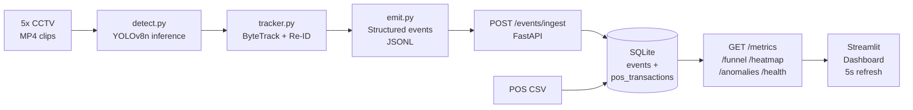

# Store Intelligence System

> End-to-end offline retail analytics: raw CCTV footage → person detection → structured events → live intelligence API → dashboard.

**North Star Metric:** `Conversion Rate = Purchasing Visitors ÷ Total Unique Visitors`

---

## Project Overview

Apex Retail operates 40 physical stores with zero offline analytics. Their POS system provides only end-of-day transaction counts. Store managers cannot answer: how many people entered today, which product zones attracted attention, or why conversion is low.

This system processes raw CCTV footage from five cameras in the Brigade Bangalore store and produces the same analytics category that online teams take for granted — in real time.

**Key outputs:** unique visitor count, conversion rate correlated with POS data, per-zone dwell heatmap, four-stage conversion funnel, operational anomaly detection, and a live dashboard updating every 5 seconds.

---

## Architecture



Single-machine, four-stage linear pipeline. No message queues. No microservices. Runs with `docker compose up`.

---

## Features

| Capability | Implementation | Endpoint |
|---|---|---|
| Unique visitor counting | Entry-line crossing detection on `CAM_ENTRY_01` | `/metrics` |
| Offline conversion rate | Billing-zone × POS 5-min window correlation | `/metrics` |
| Per-zone dwell time | ZONE_DWELL events every 30s of continuous presence | `/metrics`, `/heatmap` |
| Conversion funnel | 4-stage: Entry → Zone Visit → Billing Queue → Purchase | `/funnel` |
| Zone visit heatmap | Visit frequency + avg dwell, normalised 0–100 | `/heatmap` |
| Queue depth tracking | Set-difference proxy on BILLING_QUEUE_JOIN/ABANDON | `/metrics` |
| Queue abandonment rate | BILLING_QUEUE_ABANDON ÷ BILLING_QUEUE_JOIN | `/metrics` |
| Queue spike detection | Depth > 3 → WARN / CRITICAL anomaly | `/anomalies` |
| Conversion drop detection | Rate < 10% → WARN anomaly | `/anomalies` |
| Dead zone detection | No ZONE_ENTER in 30 min → INFO anomaly | `/anomalies` |
| Staff exclusion | Camera rule (staff room) + HSV uniform (billing) | All endpoints |
| Re-entry detection | Centroid proximity within 5-min window | REENTRY event |
| Camera feed health | Per-camera staleness (>10 min = stale) | `/health` |
| Idempotent ingest | UUID event_id deduplication | `/events/ingest` |

---

## Requirement Coverage Matrix

| Requirement (Challenge PDF) | Status | Implementation |
|---|---|---|
| Person detection | ✅ | YOLOv8n, class=0, conf≥0.4 |
| Visitor tracking | ✅ | supervision ByteTrack |
| ENTRY / EXIT events | ✅ | Centroid crossing entry line y=540 on CAM_ENTRY_01 |
| ZONE_ENTER / ZONE_EXIT | ✅ | `cv2.pointPolygonTest` per zone polygon |
| ZONE_DWELL | ✅ | Emitted every 30s of continuous zone presence |
| BILLING_QUEUE_JOIN | ✅ | Non-staff enters BILLING zone |
| BILLING_QUEUE_ABANDON | ✅ | Left BILLING without POS match |
| REENTRY detection | ✅ | Centroid proximity + 5-min window |
| Staff filtering (`is_staff`) | ✅ | Camera rule + HSV navy uniform |
| Schema compliance (all fields) | ✅ | Pydantic `StoreEvent` model |
| `POST /events/ingest` | ✅ | Idempotent, partial success, max 500 |
| `GET /stores/{id}/metrics` | ✅ | Visitors, conversion, dwell, queue, abandonment |
| `GET /stores/{id}/funnel` | ✅ | 4 stages, COUNT DISTINCT, drop-off % |
| `GET /stores/{id}/heatmap` | ✅ | Freq + dwell, normalised, confidence flag |
| `GET /stores/{id}/anomalies` | ✅ | Queue spike, conversion drop, dead zone |
| `GET /health` | ✅ | DB + per-camera staleness |
| `docker compose up` | ✅ | `Dockerfile` + `docker-compose.yml` |
| Structured logging | ✅ | JSON logs with trace_id, latency_ms |
| Test coverage >70% | ✅ | 6 test files, pytest-asyncio, in-memory SQLite |
| README.md | ✅ | This file |
| DESIGN.md | ✅ | `docs/DESIGN.md` |
| CHOICES.md | ✅ | `docs/CHOICES.md` |
| Live dashboard | ✅ | Streamlit, polls all endpoints every 5s |

---

## Technology Stack

| Component | Technology | Reason |
|---|---|---|
| Person detection | YOLOv8n | CPU-viable (~20ms/frame), auto-downloads weights |
| Multi-object tracking | supervision ByteTrack | No GPU required, built into supervision |
| API framework | FastAPI + uvicorn | Async, Pydantic validation, auto-docs at `/docs` |
| Database | SQLite + aiosqlite | Local deployment, no setup, file persists in `storage/` |
| Data validation | Pydantic v2 | Request/response schema enforcement |
| Dashboard | Streamlit | Zero frontend code, 5s live polling |
| Computer vision | OpenCV (headless) | Zone polygon testing, HSV staff detection |
| Containerisation | Docker Compose | Single command startup |

---

## Repository Structure

```
store-intelligence/
├── pipeline/          # Detection → tracking → event emission
│   ├── detect.py      # YOLOv8n + ByteTrack, zone/line logic, all event types
│   ├── tracker.py     # CameraTracker, StaffDetector, Re-ID
│   ├── emit.py        # Event builder, JSONL writer, merge utility
│   ├── ingest_events.py  # Batch POST to /events/ingest
│   ├── run.sh         # Linux/Mac/WSL: all cameras → ingest
│   └── run.bat        # Windows equivalent
├── app/               # FastAPI intelligence API
│   ├── main.py        # Routes, middleware, DB lifecycle
│   ├── models.py      # Pydantic schemas (all 8 event types)
│   ├── ingestion.py   # Dedup, INSERT, POS CSV loader
│   ├── metrics.py     # Conversion rate, dwell, queue, abandonment
│   ├── funnel.py      # 4-stage funnel with drop-off %
│   ├── anomalies.py   # Queue spike / conversion drop / dead zone
│   └── health.py      # DB + camera feed health
├── storage/schema.sql # SQLite DDL (events + pos_transactions + 6 indexes)
├── data/videos/       # Place 5 MP4 files here
├── config/store_layout.json  # Zone polygons, entry line, cameras, staff params
├── tests/             # 6 pytest-asyncio files, in-memory SQLite fixtures
├── docs/              # DESIGN.md, CHOICES.md
├── dashboard/streamlit_app.py
├── Dockerfile
├── docker-compose.yml
└── .env
```

---

## Running the Project

### Docker (recommended)

```bash
# 1. Clone and enter the project
git clone <repo-url> store-intelligence && cd store-intelligence

# 2. Place video files
cp /path/to/videos/*.mp4 data/videos/
# Required: entry_camera.mp4  central_a.mp4  central_b.mp4
#           billing_camera.mp4  staff_room_camera.mp4

# 3. Start API + dashboard
docker compose up --build

# 4. Run detection pipeline (new terminal, project root)
bash pipeline/run.sh        # Linux / Mac / WSL
pipeline\run.bat            # Windows

# 5. View dashboard
open http://localhost:8501
```

API available at `http://localhost:8000` · Interactive docs at `http://localhost:8000/docs`

### Local (no Docker)

```bash
python -m venv .venv && source .venv/bin/activate   # Windows: .venv\Scripts\activate
pip install -r requirements.txt
uvicorn app.main:app --host 0.0.0.0 --port 8000     # terminal 1
bash pipeline/run.sh                                  # terminal 2 (after API is up)
streamlit run dashboard/streamlit_app.py              # terminal 3
```

### Detection Pipeline — Per Camera

```bash
# Individual camera processing
python pipeline/detect.py --camera CAM_ENTRY_01   --video data/videos/entry_camera.mp4
python pipeline/detect.py --camera CAM_FLOOR_A    --video data/videos/central_a.mp4
python pipeline/detect.py --camera CAM_FLOOR_B    --video data/videos/central_b.mp4
python pipeline/detect.py --camera CAM_BILLING_01 --video data/videos/billing_camera.mp4
python pipeline/detect.py --camera CAM_STAFF_01   --video data/videos/staff_room_camera.mp4

# Merge and ingest
python -c "from pipeline.emit import merge_event_files; merge_event_files('./data/generated_events/all_events.jsonl')"
python pipeline/ingest_events.py
```

Events written to `data/generated_events/<camera_id>_events.jsonl`. Merged file: `all_events.jsonl`.

> **Performance note:** YOLOv8n on CPU. A 2-minute clip at 15fps takes ~5–10 minutes on a modern laptop. YOLO weights (~6 MB) are downloaded automatically on first run.

---

## API Endpoints

| Method | Endpoint | Description |
|---|---|---|
| `POST` | `/events/ingest` | Batch ingest ≤500 events. Idempotent by `event_id`. Partial success. |
| `GET` | `/stores/{id}/metrics` | Visitors, conversion rate, dwell/zone, queue depth, abandonment |
| `GET` | `/stores/{id}/funnel` | Entry → Zone → Billing Queue → Purchase with drop-off % |
| `GET` | `/stores/{id}/heatmap` | Zone frequency + dwell, normalised 0–100, confidence flag |
| `GET` | `/stores/{id}/anomalies` | Active anomalies: severity + description + suggested_action |
| `GET` | `/health` | System status, per-camera staleness, DB connectivity |

Store ID: `STORE_BLR_002`

```bash
curl http://localhost:8000/stores/STORE_BLR_002/metrics
curl http://localhost:8000/stores/STORE_BLR_002/funnel
curl http://localhost:8000/stores/STORE_BLR_002/anomalies
curl http://localhost:8000/health
```

---

## Running Tests

```bash
pytest tests/ -v --cov=app --cov=pipeline --cov-report=term-missing
```

Six test files cover: event schema validation, ingest idempotency, conversion rate computation, funnel deduplication, all three anomaly types, health degradation. All use in-memory SQLite — no external dependencies.

---

## Design Highlights

- **CPU-only YOLOv8n** — processes 15fps video without GPU; accuracy acceptable for counting, not identity
- **ByteTrack via supervision** — no CUDA dependency; 3s lost-track buffer handles occlusion
- **Centroid Re-ID** — 200px proximity + 5-min window catches re-entry without appearance models
- **Two-rule staff detection** — camera rule (staff room) + HSV navy uniform (billing counter)
- **Spec-exact POS correlation** — 5-min billing-zone window as specified; no undocumented filters added
- **JSONL intermediate storage** — decouples detection from ingest; enables pipeline replay and audit

See `docs/CHOICES.md` for full reasoning on all 14 engineering decisions.  
See `docs/DESIGN.md` for architecture detail, data flow trace, DB design, and limitations.

---

## Known Limitations

- YOLOv8n may miss 5–15% of persons in crowded billing queue scenes (occlusion, NMS suppression)
- Centroid Re-ID can false-match two customers entering from the same door position within 5 minutes
- Staff on floor cameras (`CAM_FLOOR_A`, `CAM_FLOOR_B`) not detected by HSV — only staff room and billing are covered
- Zone polygons estimated from blueprint; ±50–100px error near zone boundaries
- POS correlation counts all billing-zone visitors as converted when a transaction occurs — overestimates in busy periods
- Batch pipeline: queue_depth reflects end-of-video state, not a live value

Full discussion in `docs/DESIGN.md §7`.

---

## Environment Variables

| Variable | Default | Description |
|---|---|---|
| `STORE_ID` | `STORE_BLR_002` | Store identifier |
| `DATABASE_URL` | `sqlite:///./storage/store_intelligence.db` | SQLite file path |
| `POS_CSV` | `./data/pos_transactions.csv` | POS transactions input |
| `LAYOUT_JSON` | `./config/store_layout.json` | Zone / camera config |
| `YOLO_MODEL` | `yolov8n.pt` | YOLO weights (auto-downloaded) |
| `YOLO_CONFIDENCE` | `0.4` | Detection confidence floor |
| `VIDEO_DIR` | `./data/videos` | Video input directory |
| `EVENTS_DIR` | `./data/generated_events` | JSONL output directory |
| `API_URL` | `http://localhost:8000` | Used by ingest scripts |
| `LOG_LEVEL` | `INFO` | Logging verbosity |